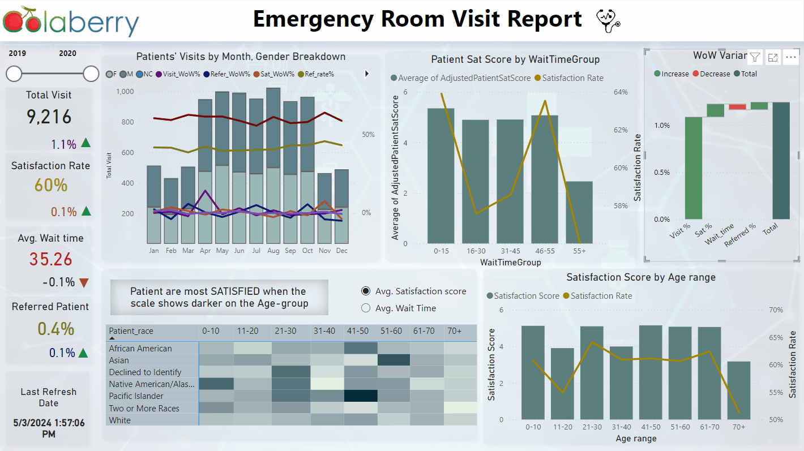
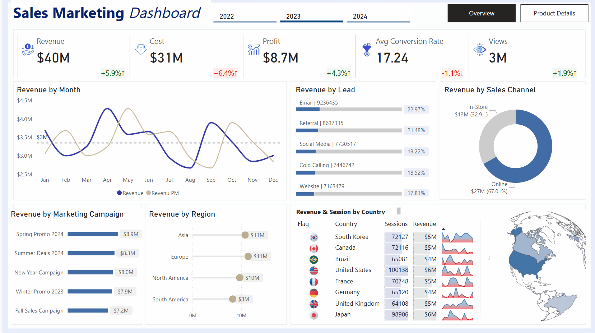
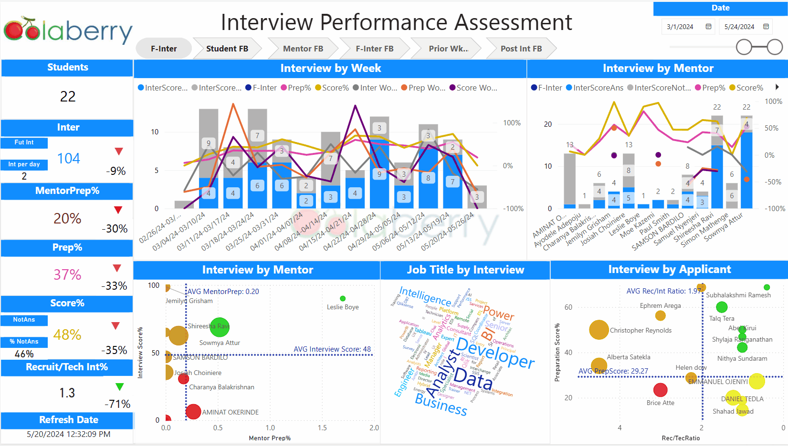
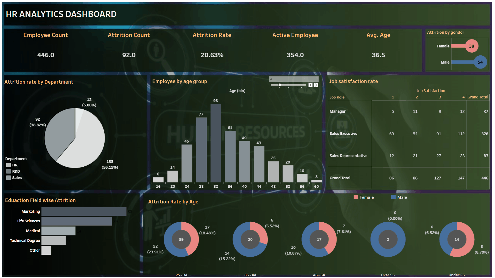

# BI Dashboard Portfolio
A portfolio of interactive dashboards built using Power BI and Tableau, covering healthcare, HR, marketing, finance, and customer analytics.

## 🔧 Tools Used
- **Power BI** – Data modeling, DAX measures, and interactive reports
- **Tableau** – Visual storytelling, calculated fields, and business exploration

---

## 📊 Power BI Dashboards

1. ### [Emergency Room Visit Report](powerbi/emergency-room-visit-report/)
   - **Industry:** Healthcare  
   - **Description:** Analyzes ER patient volume, average wait times, satisfaction scores, and weekly trends to help optimize operational efficiency.
     
    
  

2. ### [Sales Marketing Dashboard](powerbi/sales-marketing-dashboard/)
   - **Industry:** Sales & Marketing  
   - **Description:** Combines sales performance with marketing campaign metrics to track conversion rates, regional performance, and product-level insights.
     
    

3. ### [Interviewer Performance Assessment](powerbi/interview-performance-assessment/)
   - **Industry:** HR/Recruitment  
   - **Description:** Evaluates interviewer effectiveness across recruiter and technical interviews using KPIs like Rec/Tec Ratio, Prep Scores, and quadrant performance.
     
    
     

---

## 📈 Tableau Dashboards

4. ### [Netflix Dashboard](tableau/netflix-dashboard/)
   - **Industry:** Entertainment  
   - **Description:** Visualizes Netflix content library trends, genre distribution, release trends, and country-wise content availability.

5. ### [Customer Analytics Dashboard](tableau/customer-analytics-dashboard/)
   - **Industry:** Marketing/Consumer Insights  
   - **Description:** Segments customers by behavior and demographics to identify profitable groups and track key engagement metrics.

6. ### [HR Analytics Dashboard](tableau/hr-analytics-dashboard/)
   - **Industry:** Human Resources  
   - **Description:** Tracks employee satisfaction, attrition rate, department-wise trends, and training participation across the organization.
     

7. ### [Bank Customers Dashboard](tableau/bank-customer-dashboard/)
   - **Industry:** Finance/Banking  
   - **Description:** Analyzes customer demographics, account types, credit card usage, and churn indicators to support data-driven retention strategies.

---

## 🧭 How to Navigate
Each dashboard folder contains:
- `summary.md`: Overview, data used, KPIs tracked, insights
- `screenshots/`: Sample images of the dashboard UI
- `dax-formulas.md` *(for Power BI)*: Key DAX measures with descriptions

---

## 📫 Contact  
If you'd like to connect, collaborate, or provide feedback, feel free to reach out via [LinkedIn](https://www.linkedin.com/in/senayit-berhane/) or [Email](Senayita.hac@gmail.com).

---
